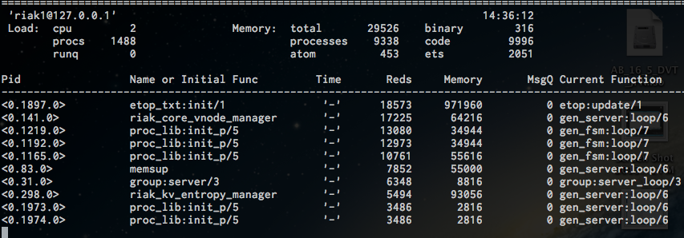

!SLIDE

# Observer, Eper

## - ついでに gen\_fsm 入門 -

@ksauzz

!SLIDE

# 今日の話

- **Observer**
- **Eper**
- **gen\_fsm** 入門

!SLIDE

# **Observer** & **Eper**

!SLIDE

# Observer ?

!SLIDE

!SLIDE

# Observerアプリケーション

トレース、調査用のツール群 (**OTP**)

- **ttb**:      Traceツール
- **etop**:     Erlangのtop
- **observer**: ttbのフロントエンド
- **crash dump viewer**:  erl\_crash.dumpのviewer

!SLIDE

# ttb

!SLIDE

## ttb

Erlangのトレースツール

- Module, Functionがどう呼ばれているのか、どんな値を返したか？を確認できるツール

詳細は後ほど**Observer**のデモで！

- **redbug**の方が使い易い(筈)

!SLIDE

# etop

!SLIDE

## etop

**Erlang Top** is a tool for presenting information about erlang processes similar to the information presented by "**top**" in **UNIX**.

### Erlang用の**top**コマンドです

!SLIDE

## etop

- **graphical** mode
- **text** mode

!SLIDE

# etop: **graphical** mode

!SLIDE

# etop: **text** mode

!SLIDE

# etop 出力値

- Memory
- - **Total** - 全メモリ使用量
- - **processes** - プロセスのメモリ使用量 (bytes)
- - **atom** - atomのメモリ使用量
- - **binary** - binary heapサイズ
- - **code** - loadされたcodeのメモリ使用量
- - **ets** - etsのメモリ使用量

!SLIDE

# etop 出力値

- Table
- - **Pid** - プロセスID
- - **Name or Initial Function** - プロセス名 or 初期化関数
- - **Time** - 実行時間
- - **Reds** - 実行された命令数
- - **Memory** - プロセスのメモリ使用量 (bytes)
- - **MsgQ** - メッセージ・キューサイズ(プロセスのmailbox size)
- - **Current Function** - 現在の関数

!SLIDE

# etop options

- **node**:       測定対象ノード名
- **setcookie**:  接続先ノードのセキュアクッキー
- **sort**:       ソート対象
- **lines**:      表示行数
- **accumulate**: time, reduction収集の有無
- **tracing**:    trace機能のon/off
- **interval**:   測定間隔

!SLIDE

# **riak-admin** top

    erl -noshell -noinput -pa ./lib/basho-patches
      -hidden -name riak_etop49445@127.0.0.1
        -setcookie riak -s etop -s erlang halt -output text
          -node riak1@127.0.0.1 -tracing off

!SLIDE

# **riak-admin** top

    riak-admin top -sort memory -lines 20
    riak-admin top -interval 1 -sort msg_q

!SLIDE

# observer

!SLIDE

# observer

**ttb**のフロントエンド

- トレース以外も色々できる
- Erlangの **wx** supportが必要

!SLIDE

# observer

デモ

!SLIDE

# observer

    observer:start().

!SLIDE

# 参考： observerの導入 (Ubuntu)

wxを有効にしたErlangのビルド

- **いつもの**

    apt-get install build-essential libncurses5-dev openssl libssl-dev

- **wxの依存ライブラリ**

    apt-get install freeglut3-dev libwxgtk2.8-dev wx2.8-headers wx-common

!SLIDE

# 参考： observerの導入 (Ubuntu)

    % ./otp_build autoconf
    % ./otp_build configure  --enable-dtrace
        --disable-hipe --enable-smp-support
         --enable-threads --enable-kernel-poll
           --prefix=/usr/local/erlang/OTP_R15B01
    % make && make install

あとはPATHを適当に設定

!SLIDE

# crash dump viewer

!SLIDE

# crash dump viewer

erl\_crash.dumpのviewer

!SLIDE

# crash dump viewer

デモ

!SLIDE

# crash dump viewer

    crashdump_viewer:start().

!SLIDE

# Eper ?

!SLIDE

!SLIDE

# Eper

observerと似たなツール群

- **dtop**:   Topコマンド
- **redbug**: Traceツール
- **gperf**:  CPU, Memory usage
- **sherk**:  profiler

 
redbug以外はドキュメントが無いのでソース読まないと使えない...orz

!SLIDE

# Eper

今日はdtopとredbugの話のみ

- **dtop**:   Topコマンド
- **redbug**: Traceツール
- <s>**gperf**:  CPU, Memory usage</s>
- <s>**sherk**:  profiler</s>

 
m(\_ \_)m

!SLIDE

# dtop

!SLIDE

# dtop

- etopと同じくErlang用のtopコマンド
- 手軽さはあるが、機能が少ない
- コマンドの複雑さに目をつぶればetopの方がよさそう

!SLIDE

# dtop usage

      dtop:start().
      dtop:sort(cpu).
      dtop:sort(mem).
      dtop:sort(msgq).

!SLIDE

# dtop

デモ

!SLIDE

# redbug

!SLIDE

# redbug

- Traceツール
- 簡単に扱える
- **Module**, **Function**, **Args**を指定してTrace
- 戻り値、StackTraceも取得可

!SLIDE

# redbug usage

- Traceする**期間**を指定
- Traceする**メッセージ数**を指定
- Traceする**Module:Function**を指定

!SLIDE

# redbug usage

> redbug:start(Time,Msgs,Trc[,Proc[,Targ]])

- **Time**: タイムアウト ms
- **Msgs**: 受信メッセージ数
- **Trc**: list('send'|'receive'|{M,F}|{M,F,RestrictedMatchSpecs})
- **Proc**: 'all'|pid()|atom(Regname)|{'pid',I2,I3} Targ: node()
- **RestrictedMatchSpecs**: list(RMS)
- **RMS**: 'stack'|'return'|tuple(ArgDescriptor)
- **ArgDescriptor**: ''|literal()

!SLIDE

# redbug 実行例
### 5secタイムアウト、20メッセージ受信

    % riak_kv_get_fsmの呼び出しをtrace
    redbug:start(5000,20, {riak_kv_get_fsm, '_'}).

    % riak_kv_get_fsm:executeの呼び出しをtrace
    redbug:start(5000,20, {riak_kv_get_fsm, execute}).

    % riak_kv_get_fsm:executeの呼び出しと戻り値をtrace
    redbug:start(5000,20, {riak_kv_get_fsm, '_', [return]}).

!SLIDE

# redbug 実行例
### 5secタイムアウト、20メッセージ受信

    % riak_kv_get_fsm:execute の呼び出しと戻り値, stacktraceをtrace
    redbug:start(
        5000,20, {riak_kv_get_fsm, '_', [return, stack]}).

    % riak_kv_get_fsm:execute(pw, _, default)の
    %       呼び出しと戻り値, stacktraceをtrace
    redbug:start(
        5000,20, {riak_kv_get_fsm, '_',
           [{pw,'_',default},return, stack]}).

!SLIDE

# redbug

デモ

!SLIDE

# redbug 導入方法

- rebar.conf

  or

- makeして export ERB\_LIBS=$ERB\_LIBS:install\_pathとか

  (試してないけど)

!SLIDE

# gen\_fsm 入門

!SLIDE

# gen\_fsm とは

- 有限ステートマシン用のライブラリ
- 状態遷移とそれに伴うメッセージ管理を楽にしてくれる

!SLIDE

# 有限ステートマシンの復習

- **状態**
- **イベント**
- **アクション**
- **次の状態**

!SLIDE

# 使い方

- プロセス起動
- 初期化
- (状態 x イベント)と対応する(アクション x 次の状態)

!SLIDE

# プロセス起動

    gen_fsm:start_link(local, ?MODULE}, ?MODULE, [], [])

!SLIDE

# 初期化

    init(Args) ->
        %% 初期化処理
        {ok, locked, State}.    <-- 第２引数で次の状態を指定

!SLIDE

### (**状態** x **イベント**)と対応する(**アクション** x **次の状態**)

    locked({push},State) ->
        %% pushに対応するアクション
        {next_state, locked, State};
    locked({coin, Cnt},State) ->
        %% coinに対応するアクション
        {next_state, unlocked, State}.

!SLIDE

# タイムアウト

    locked({coin, Cnt},State) ->
        %% coinに対応するアクション
        {next_state, unlocked, State, 10000}.  <-- Timeout設定(ms)

    unlocked(timeout, State) ->
        %% Timeout処理
        {next_state locked, State}.

!SLIDE

# イベントのトリガ

    push() ->
        gen_fsm:send_event(?MODULE, {push}).

    coin(Cnt) ->
        gen_fsm:send_event(?MODULE, {coin, Cnt}).

!SLIDE

# サンプルコード

!SLIDE

# サンプルコードの動かし方

コンソールを２つ立ち上げます

- コンソール1から
- - make console

- コンソール2から
- - make attach

!SLIDE

# サンプルコードの動かし方

- コンソール1から

     redbug:start(10000, 20, {sample, [return]}).

- コンソール2から

    sample:start\_link().
    sample:push().
    sample:coin(1).
    sample:coin(1).
    sample:coin(1).
    sample:push().

!SLIDE

# 参考: gen\_fsm スケルトン生成

    % ./rebar create-app appid=sample
    ==> sample (create-app)
    Writing src/sample.app.src
    Writing src/sample_app.erl
    Writing src/sample_sup.erl

!SLIDE

# 参考: gen\_fsm スケルトン生成

    % ./rebar create template=simplefsm fsmid=sample
    ==> sample (create)
    Writing src/sample.erl

!SLIDE

# 参考資料

- [Erlang User's Guide](http://erlang.shibu.jp/design_principles/gen_fsm.html)

!SLIDE

# ご静聴ありがとうございました。

!SLIDE
